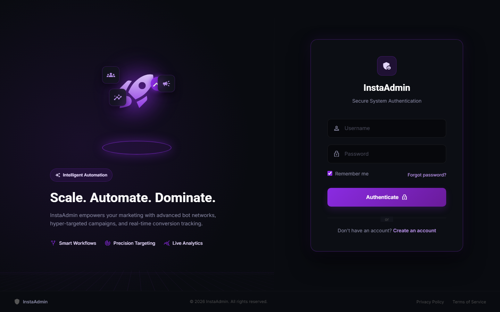
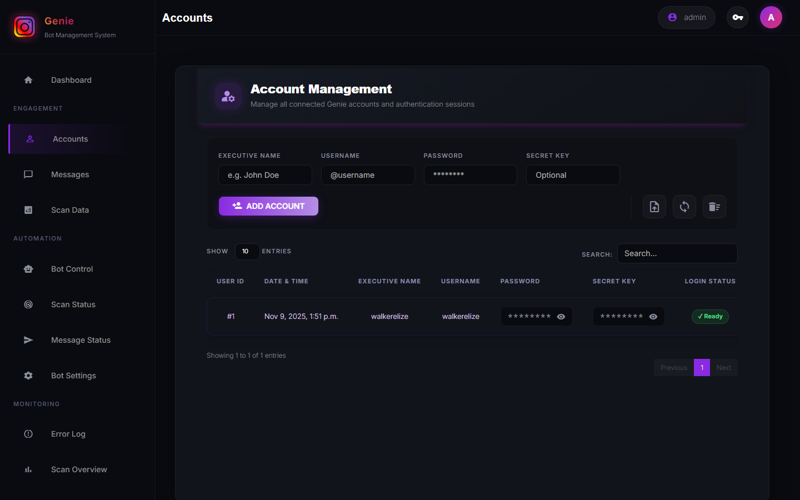
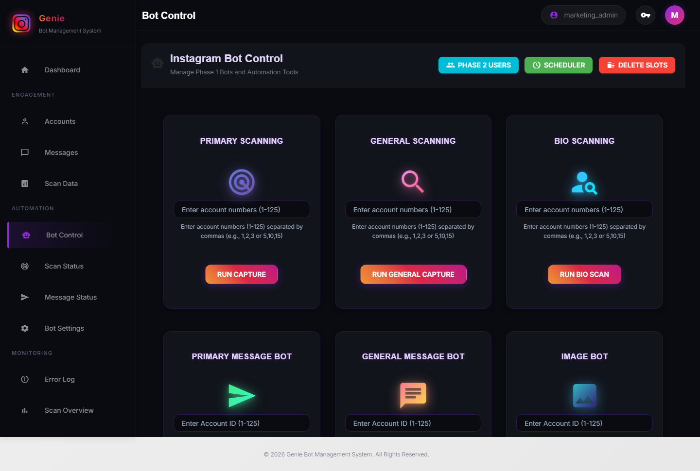
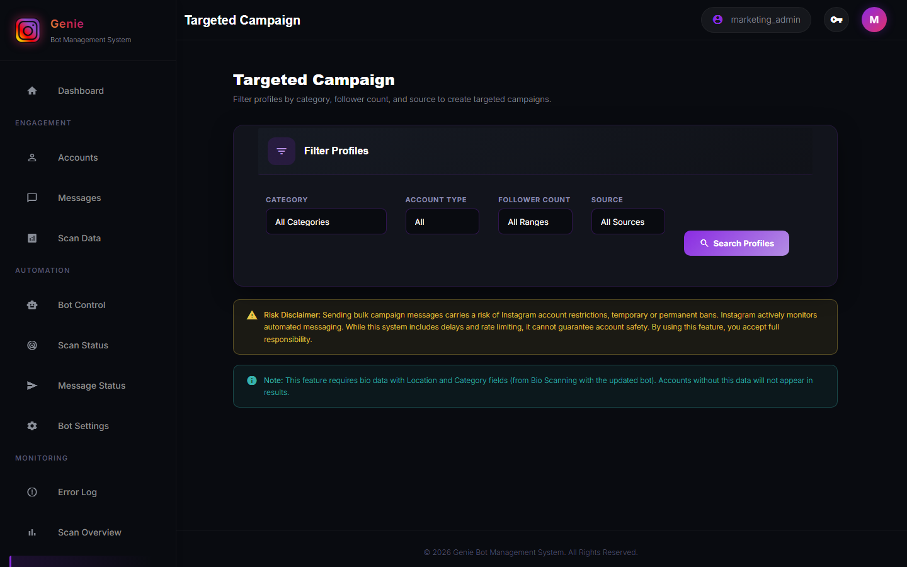

  
  <h1>InstaAdmin: Enterprise Social Media Automation Engine</h1>
  
<strong>Scale. Automate. Dominate.</strong>

  
    
  
<i>The ultimate control center for intelligent, large-scale marketing campaigns.</i>

 

## 🚀 System Overview
**InstaAdmin** is a highly proprietary, enterprise-grade social media marketing automation platform. Built with a decoupled **Django + FastAPI** architecture, it serves as the command center for orchestrating massive fleets of automated accounts (up to 125+ concurrent bots). 

Featuring a modern, meticulously crafted **Dark Neon Glassmorphism UI**, InstaAdmin provides a seamless and visually stunning experience for managing complex workflows, parsing thousands of user bios, and executing hyper-targeted outreach campaigns at scale.

*Disclaimer: This repository serves strictly as a frontend and feature portfolio. The core proprietary execution engine, AI integration logic, and headless scraping models are kept completely confidential.*

---

## 🔥 Enterprise Capabilities

### 1. 🤖 Bot Fleet & Instance Orchestration
- **Massive Concurrency**: Manages and schedules 1-125 independent account runners simultaneously via FastAPI and asynchronous job queues.
- **Advanced Device Fingerprinting**: Every bot instance runs with isolated User-Agents, distinct Device-IDs, isolated Session PKL files, and dynamically jittered startup delays to completely circumvent platform anti-bot measures.
- **Fleet Health Monitoring**: Live dashboard tracking proxy health, authentication statuses (`✓ Ready` / `✗ Required`), and interaction limits.

### 2. 🎯 Hyper-Targeted AI Campaigns (ChatGPT Integrated)
- **Dynamic Message Generation**: Deep integration with LLMs (e.g., ChatGPT) to generate highly contextual, varied, and personalized outreach messages based on the scraped bio details of targets.
- **Intelligent Flow Control**: Bypasses spam filters with dynamically varied prompt temperatures, avoiding fixed marketing copy and ensuring natural conversation flow.
- **Seen Status Tracking**: Real-time tracking of message read-receipts and engagement, feeding back into campaign analytics.

### 3. 🧠 Deep Audience Scraping & Lead Gen
- **Bio Scanning Engine**: Automatically parses large swaths of users to extract emails, websites, keywords, and specific profile traits.
- **General Scraping**: Harvest user lists from competitors, specific hashtags, or geographical locations with extreme efficiency.
- **Database Centralization**: All scraped leads are piped into a centralized MySQL/SQLite warehouse for campaign filtering.

### 4. 💬 Engagement Automation
- **Comment Bot**: Identifies trending posts within niches and deploys contextually relevant auto-replies.
- **Auto-Responder**: Filters incoming messages based on sentiment and keyword triggers, managing initial follow-ups seamlessly.

---

## 💻 Interface Showcase

InstaAdmin is built for performance but designed like a premium SaaS product. The interface eliminates eye strain for extended monitoring sessions and uses an intuitive layout to handle complex data density.

### 🔐 Secure Authentication Portal
*Immersive, split-screen glassmorphism design emphasizing the system's focus on enterprise automation and security.*

  

### 🎛️ Operations Dashboard (Real-time Analytics)
*The central hub showing system metrics, queue statuses, and overall campaign health.*

  

### ⚙️ Core Bot Control Hub (API Run)
*The absolute heart of InstaAdmin. This interface commands the execution of 11 highly specialized bot families across all 125 instances concurrently:*
- **Primary & General Scanning (`capture / general_capture`)**: Scours target audiences, hashtags, and competitors to build initial lead lists.
- **Bio Scraper (`profile_scraper_runner`)**: Deep-scans targeted profiles, extracting keywords, follower counts, and outbound links into a centralized database.
- **LLM Message Generator (`message_generator`)**: Analyzes scraped bios and utilizes ChatGPT API to dynamically craft context-aware, highly personalized outreach text.
- **First & Primary Message Bots (`first_message / message`)**: Executes the initial cold outreach with built-in human-delay jitter to bypass spam algorithms.
- **General Message Bots (`general_message`)**: Handles broad-stroke announcements and secondary follow-ups.
- **Seen Status Bot (`seen_bot`)**: Monitors DM threads for read receipts, tracking engagement metrics in real-time.
- **Comment Bot (`comment_bot`)**: Automatically posts context-relevant comments on leads' latest media to boost visibility before DMing.
- **Image Bot (`images`)**: Handles the distribution of targeted media/promotional images within DMs.
- **Delete Blocked Users (`delete`)**: Automatically prunes blocked, dead, or unresponsive targets from the execution queues to preserve proxy and account health.

  

### 🎯 Targeted Campaign Configuration
*Set up precise outreach strategies, configure LLM prompts, and manage target demographics.*

  

---

## 🛡️ Architecture & Security
- **Django Administration**: Serves the UI, handles user authentication, and provides the CRM logic.
- **FastAPI Engine**: High-performance backend orchestrating the actual Python-based bot scripts (`message.py`, `bio_scraper.py`, etc.).
- **Headless Execution**: Built to interface with Chromium/Playwright for completely undetectable automation.
- **End-to-End Encryption**: Secure storage for all proxies and account credentials.

---

## 📬 Licensing & Inquiries
Interested in deploying InstaAdmin or commissioning a custom automation infrastructure tailored to your brand's growth needs? 

**Contact us to discuss enterprise solutions and licensing opportunities.**
